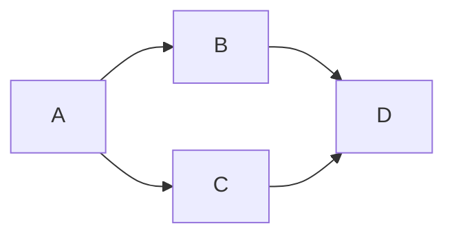

# Native execution architecture review

Date: 2026-10-02. Reviewed baseline: `63602fb`.
Scope: review and required changes only, as requested by the user. No runtime or
SDK behavior changed. This reviews the native execution path, its extension data
contracts, component barriers and UI publication. It is not a complete security
or performance audit of every copied dependency.

## Assessment

The current adapter provides dependency-ordered **sequential execution on one
background worker**. It does not support selecting parallel node execution or a
worker count. The DAG and snapshot boundaries are a useful foundation, but safe
configurable parallel execution and live chain progress require further work.
The name `ParrallelProgress` does not imply that nodes run concurrently.

| Capability                          | Current implementation                                 | Assessment                               |
| ----------------------------------- | ------------------------------------------------------ | ---------------------------------------- |
| Producer before consumer            | Required-input validation and dependency readiness     | Implemented for sequential execution     |
| Cycles and incompatible connections | Preflight rejects before delegate execution            | Implemented                              |
| Independent branches after failure  | Failed consumers skip; independent work continues      | Implemented                              |
| Components                          | External-input and whole-body completion barriers      | Implemented; preserve in a new scheduler |
| UI isolation and stale results      | Graph snapshot; revision and request-generation checks | Implemented                              |
| Sequential / parallel selection     | One worker, synchronous delegate loop                  | Missing                                  |
| Configurable bounded node workers   | No execution-options contract                          | Missing                                  |
| Threads inside an individual node   | No shared thread budget or internal-work contract      | Unspecified                              |
| Live node states and chain progress | Final future and aggregate status text only            | Missing                                  |
| Shared output safety                | Mutable members shared between consumers               | Convention, not an enforced contract     |
| Selective recomputation             | Every submission recomputes the graph                  | Deferred                                 |

## Findings, ordered by priority

### 1. High: parallel node execution is absent

Evidence: `native/app/pipeline/PipelineExecution.h:54` constructs a queue with one
worker. `PipelineExecution.cpp:157` takes one ready context and calls
`executeStep` synchronously at line 170, then returns the completed context at
line 192. `submit` queues one task for an entire graph, not one task per node.

Increasing the legacy queue thread count alone would allow different graph
submissions to overlap; each graph would still execute its own nodes sequentially.
It could also invoke the same shared delegate concurrently across runs without
a declared reentrancy guarantee. It does not satisfy parallel graph scheduling.

Required change: add explicit sequential and parallel execution options with a
positive, bounded worker limit. Use the same validated dependency plan for both.
Default to sequential until node/data safety contracts are established.

### 2. High: scheduler state has no concurrent ownership protocol

Evidence: `native/vendor/legacy/tp_pipeline/src/PipelineManager.cpp:319` scans
contexts and mutates `runStarted` and inputs. `returnCompletedStep` at line 372
sets `runComplete` and scans readiness. `StepContext.h:49` and line 52 use plain
booleans; `StepContext.cpp:16` reads upstream completion without synchronization.
These operations are safe under the current single-owner loop. Calling them from
multiple workers would introduce races and potentially duplicate dispatch.

There is also a termination hazard in a naive parallel adaptation: no ready node
can mean that upstream work is still in flight. The current loop exits when
`takeNextAvailableStep` returns null. A parallel coordinator must wait for
completions in that case, rather than declare the graph finished.

Required change: one coordinator owns dependency counters, readiness, dispatch,
completion state and result aggregation. Workers execute isolated node contexts
and send synchronized completion records. Only the coordinator calls legacy
manager methods if that manager is retained. Publish worker outputs through the
completion queue/future before reading them or releasing successors. Making a
few flags atomic would not protect the rest of the state or containers.

### 3. High: mutable shared inputs and shared delegates prevent a general safety guarantee

Evidence: `PipelineManager.cpp:354` adds the producer's existing shared member to
the consumer input. `StepContext.h:84` returns a mutable `T*`, even from a const
context. `Collection.h` similarly exposes mutable members through const access.
`StepOutput.cpp:97` renames a supplied member when publishing it.

A node can therefore mutate an upstream result, or republish the same member
under another identity. In a parallel fan-out, another consumer could read or
write that member simultaneously. Even sequential execution would make results
depend on branch order if a delegate mutates shared inputs. `shared_ptr<const
Collection>` in final results does not provide deep immutability.

Bundled scene/data delegates create new output members and read/copy upstream
values. That supports the current convention; it does not establish a safety
contract for future extensions or all nested domain data.

The registry also owns one delegate instance per type. A const `executeStep`
method does not prove that internal mutable state, a library or an external
resource is safe for concurrent use.

Required change: expose immutable input views and require newly owned output
members, or use explicit copy-on-write/deep cloning for mutable processing.
Audit nested scene/material ownership before opting into concurrency. Add
source-level execution metadata for reentrant nodes, per-instance execution
state and named exclusive resources. Unknown safety should serialize by default.
Keep graph parameters immutable during execution and forbid worker UI access.

### 4. Medium: execution progress is internal and only final states reach the UI

Evidence: `PipelineExecution.h:14` defines only Succeeded, Failed and Skipped.
`ExecutionHandle` exposes cancellation and a final future. The progress object
is local to `execute`; no observer or progress snapshot reaches the controller.
`ExecutionController.cpp:86` polls only final future readiness. The UI displays
aggregate messages such as Running and Complete, without live per-node state.

The adapter never calls `ParrallelProgress::childStepFinished`. Its destructor
copies children and sets the parent to Done. This internal helper is suitable
for the current adapter's diagnostics/cancellation use, but is not a live,
accurate graph progress API and must not be exposed as one unchanged.

Required change: immutable, run-tagged progress snapshots with Waiting, Ready,
Running, Succeeded, Failed, Skipped and Cancelled states. Include completed/total
counts, optional per-node fractions, and diagnostic text. Deliver/coalesce on
the Qt thread and reject old run events using the same revision/generation
checks as final results. Do not let callbacks access UI from a worker.
Define counts against compiled steps and aggregate visible component states
separately to avoid double counting. A fraction based on node count measures
completed work items, not predicted elapsed time. A cancelled or failed run must
retain its terminal status even when all work items have reached a terminal state.

### 5. Medium: cancellation and internal node threading need explicit resource/lifetime rules

Evidence: cancellation uses an atomic flag and cooperative progress polling.
`native/vendor/legacy/tp_task_queue/src/TaskQueue.cpp:249` waits for active workers
during destruction. `ExecutionController` cancels in its destructor but executor
destruction still waits. A long delegate that ignores polling can delay closing
the window or starting the latest edited graph.

Required change: stop dispatching when cancelled; signal all active workers;
join/drain them before destroying contexts, progress objects, or registry state;
publish no cancelled outputs. Define polling expectations and show cancelling
until work actually stops. Preserve revision/generation rejection for progress
and outputs. Hard interruption of arbitrary in-process C++ work is not a safe
substitute for cooperation; isolated processes can be considered for a concrete
non-cooperative workload later.

Graph parallelism and parallel work inside one node need a shared resource budget.
Otherwise N concurrent nodes each launching M threads can oversubscribe the
machine. Avoid workers blocking on child jobs submitted to the same exhausted
pool. Specify whether a node uses single-threaded work, a bounded internal parallel
facility, or a declared external library thread budget.

## Required chain semantics

For `A -> B -> C`, B must await successful A and C must await successful B in
every mode. More threads cannot parallelize those dependencies.

For a diamond, only independent branches may overlap:

A finishes first; B and C may then run concurrently; D waits for both to
complete successfully. If B fails, D skips while C and unrelated branches can
finish, preserving the current branch-local failure policy.

The component's body must wait for all external input dependencies; external
consumers must wait for its entire body, including unexposed branches. Preserve
both expanded and visible component cycle validation. A valid data DAG must
remain valid after component barriers are applied.

Do not use stored node order to define side effects. Independent side-effecting
operations need explicit ordering dependencies or declared resource constraints.
Resource exclusion prevents overlap; it does not by itself define semantic order.
Sequential mode should use stable stored-node order to break ties among ready
nodes. Parallel mode cannot promise a deterministic completion order; pure-node
output values should still agree with sequential execution.

## Proposed implementation checkpoints

These are recommendations for later implementation, not delivered milestones
or an approved final public API. Keep changes within native pipeline/SDK ownership;
do not implement the reserved TypeScript runtime for this native requirement.

1. **Execution contract and plan:** source-level options, thread-safety/resource
   metadata, immutable input rules, validated dependency plan including component
   barriers. Preserve existing sequential behavior and unsupported-content checks.
2. **Bounded scheduler:** one coordinator and a bounded worker pool, worker
   completion channel, exact-once dispatch, dependency release after output
   validation, failure propagation, cancellation and lifetime handling. Provide
   sequential/parallel modes and worker-count control through the native app.
3. **Visible progress:** thread-safe snapshots, stable run identity, component
   aggregation, node states, counts and optional fractions; Qt-thread publication
   and stale-event rejection. Keep transient status out of project persistence.
4. **Internal node parallelism:** shared thread/resource budget and audited
   extension opt-in where a demonstrated workload benefits. Avoid nested-pool
   deadlocks and uncontrolled external library threads.

Each implementation checkpoint needs its own tests, documentation and commit.
Retain the included 3D workflow and validate the scheduler independently through
the non-3D data extension.

## Acceptance tests required before claiming parallel support

- A reversed stored chain executes in dependency order in sequential mode and
  with parallel limits 1, 2 and several workers, producing equal values.
- Two gated independent nodes demonstrably overlap with limit 2; they do not
  overlap in sequential mode. Measure active workers to prove the configured cap.
- A diamond/fan-in consumer cannot start until both parents have completed and
  published validated outputs. Count unique producer dependencies when several
  input ports come from the same node. Execute every node at most once.
- No-ready-but-in-flight work waits rather than returning early. Empty graphs,
  disconnected branches, cycles and unsupported nodes have defined results.
- Repeated instances of one type honor reentrancy/resource policy; fan-out does
  not mutate shared inputs. Resource serialization and explicit side-effect
  order hold in both modes.
- Failure/exception/invalid output skips only downstream consumers. Independent
  branches finish. Component input barriers and failed unexposed branches hold
  across adjacent components in all modes.
- Cancel before start and during overlapping work; no new dispatch, partial
  publication, stale progress, dangling callbacks or premature context teardown.
  Edit/reopen during a run still rejects both old progress and final output.
- Progress states/counts are consistent and monotonic within a run; fractions
  and component aggregation follow documented rules; Qt updates run on the UI
  thread. Node-internal work cannot deadlock a saturated pool.
- Exercise a large DAG to check that readiness processing does not repeatedly
  scan the whole graph. Run stress/race tooling where available; timing-only tests
  do not establish freedom from races.

## Verification

See the [review handoff](../agents/handoffs/2026-10-02-execution-architecture-review.md)
for commands, results and environment limitations. Existing tests verify the
sequential migration foundation; they do not prove concurrent safety or live
progress semantics. Packaged desktop interaction acceptance remains pending.
