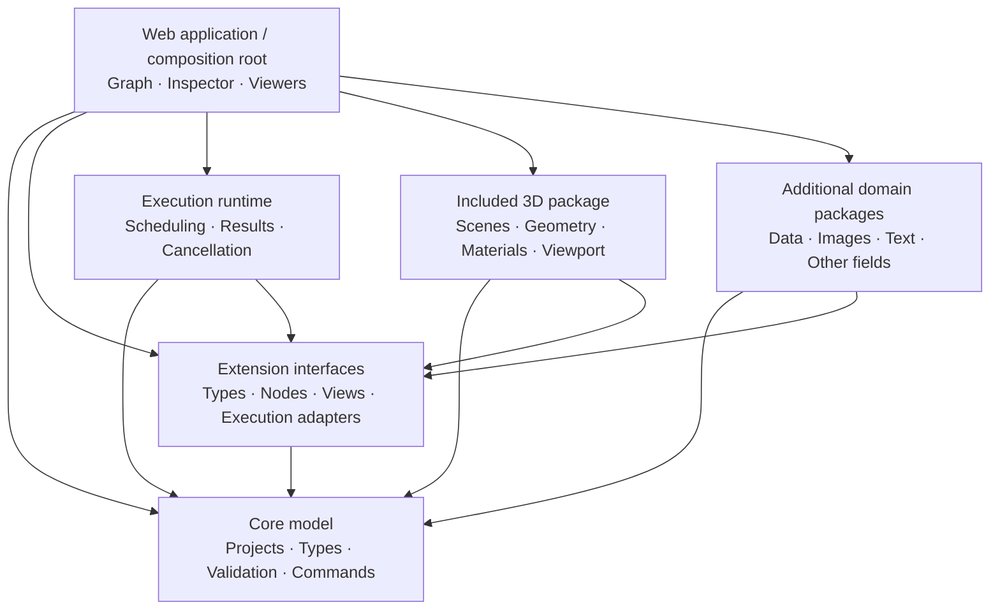

# SmartFlow — Product Proposal

Status: native C++/Qt selected as the starting application by the user on 2026-09-27. TypeScript/browser work is retained for a future extension. The application domain and audience remain open. Interactive node graphs, extensibility, and 3D scene support are requirements. Earlier browser/platform candidate sections below are exploratory background, superseded where they conflict with [decision 0003](../architecture/decisions/0003-native-first.md).

This proposal describes an independent product in a new repository. It originates from Pipeline Builder and 3D scene applications, and must retain the ability to build and visualize 3D scene workflows. Reuse audited native source by copying it with its licenses into SmartFlow; builds must not depend on the old checkout. Its architecture should support additional domains through extensions.

## 1. Product vision

An extensible visual workspace for building processes and interacting with their results, with 3D scene workflows as a required initial capability.

Users connect nodes, change parameters, run a graph, and inspect what happens. Outputs can be images, data, text, audio, or 3D scenes. The graph and its live viewers form the core experience.

The central interaction is:

**Connect → adjust → execute → inspect → reuse.**

The initial product promise is:

> Build an interactive tool by connecting operations, then reuse or share it.

### Example applications

- **Images:** load an image → adjust colors → resize → compare results.
- **Data:** load a table → filter rows → calculate values → display a chart.
- **3D:** load geometry → transform it → assign materials → inspect a scene.
- **AI:** provide inputs → run a model → review outputs → feed a result into another operation.

These are possible applications of the same foundation, not a commitment to implement every domain. 3D support is a product requirement and the initial reference domain. Domain-specific concepts belong in extensions so that other fields can use the platform without adopting a 3D scene model.

### Audience and field remain open

The final audience and application field have not been selected. Do not assume that this will become exclusively a 3D editor, an automation tool, a data application, or an AI workflow tool.

Explore three roles during prototyping: people composing graphs, developers providing extensions, and people using a finished graph through exposed controls. One person may occupy several roles. These are interaction roles, not a chosen market.

### Product principle

Build a domain-independent foundation, prove it with a complete 3D workflow, and test its extensibility with a small non-3D workflow. This validates useful behavior without requiring a final market decision first.

"Extensible to other fields" means providing contracts for new data, operations, interfaces, and execution backends. It does not mean that every future domain will work without additional engineering. Streaming, simulation, and other execution models may eventually require new runtime capabilities.

## 2. Workspace experience

The workspace has four connected areas:

| Area         | Purpose                                                                    |
| ------------ | -------------------------------------------------------------------------- |
| Node library | Find operations, inputs, viewers, and reusable components.                 |
| Graph canvas | Create connections, organize nodes, and understand dependencies.           |
| Inspector    | Edit parameters and inspect a node's inputs, outputs, and execution state. |
| Viewer area  | Display live results: image, table, chart, text, or 3D scene.              |

Users can pin several outputs into viewers. Selecting a node can temporarily preview its result without replacing pinned views.

Interaction works in both directions: a viewer displays outputs, while deliberate actions, such as selecting an object or adjusting a transform, can update defined graph parameters.

An explicit interaction rule is essential:

- Moving the viewing camera changes the workspace.
- Editing a scene object changes the project through a defined operation.

Keeping these behaviors distinct avoids surprising graph changes.

### Build and use modes

Eventually, the app can offer two modes:

- **Build:** edit the graph and create reusable components.
- **Use:** interact with exposed controls and viewers through a simplified interface.

Use mode turns a graph into a small application.

## 3. Core concepts and modularity

| Concept    | Responsibility                                                          |
| ---------- | ----------------------------------------------------------------------- |
| Project    | Stores graphs, asset references, dependencies, and workspace layout.    |
| Node       | Defines an operation with typed inputs, outputs, and parameters.        |
| Connection | Passes a value or asset reference between compatible ports.             |
| Graph      | Describes how operations depend on one another.                         |
| Runtime    | Validates and executes the graph, tracks progress, and manages results. |
| Viewer     | Presents a supported output type and optional interactions.             |
| Package    | Adds nodes, data types, viewers, or integrations.                       |
| Component  | Wraps a graph into a reusable node with exposed inputs and controls.    |

### Platform and domain boundaries

The platform owns graph editing, project persistence, undo/redo, type registration, execution coordination, extension discovery, and workspace composition.

Domain packages own their data models, operations, parameter editors, viewers, import/export formats, and external integrations. The platform must not assume that every project contains a scene, camera, mesh, or material.

The initial product includes a maintained 3D package. Keeping it modular is an architectural decision; it does not make 3D support optional in the planned first release. Other packages use the same public extension interfaces.

Reusable graphs should be the first form of extensibility. Users should not need to write a plugin just to combine existing operations into a useful tool.

Code packages provide the next level: entirely new operations, integrations, and viewers.

### Extension contract

An extension should declare:

| Contract                   | What it describes                                                                             |
| -------------------------- | --------------------------------------------------------------------------------------------- |
| Identity and compatibility | Stable package identifier, version, supported platform API versions, and dependencies.        |
| Data types                 | Type identifiers, serialization, validation, and explicit conversion operations where needed. |
| Nodes                      | Stable node identifiers, typed ports, parameters, execution behavior, and result metadata.    |
| Interface contributions    | Parameter controls, viewers, optional panels, and commands integrated with project undo/redo. |
| Execution capabilities     | Browser, local, or remote implementations and required resources or services.                 |
| Project compatibility      | How saved node configurations migrate when a package changes.                                 |

Register node types and viewers through these interfaces rather than adding domain-specific branches to the core. Extensions should be able to reuse types from declared dependencies, allowing graphs to combine domains through compatible ports or explicit adapter nodes.

Projects record their package dependencies. If a package is unavailable, preserve its nodes, connections, and saved parameters, show what is missing, and disable affected execution instead of discarding project data.

Start with bundled, trusted packages and a developer extension interface. Define execution boundaries and access to files or services before supporting arbitrary third-party code; running code in a worker alone is not a complete permission model. A public marketplace is a separate, later product decision.

### Initial 3D package

The first 3D package provides scene, geometry, material, camera, and light types; basic creation or import operations; transforms; scene assembly; and an interactive scene viewer.

Keep the execution graph and the scene hierarchy distinct. The graph describes how a scene is produced; the scene hierarchy describes objects and their relationships in the output. A graph node may produce many scene objects.

The scene viewer should support camera navigation, object selection, and inspection. Editable viewer controls must target explicit graph parameters or commands so changes remain reproducible and undoable.

A separate data or text package should demonstrate that a project can run without any 3D nodes, viewers, or scene initialization.

## 4. Execution model

A node canvas alone is a diagram editor. The execution model determines whether the product supports useful interactive work.

The first version should provide:

- **Typed connections:** catch incompatible inputs before execution.
- **Dependency-based execution:** run upstream operations before their consumers.
- **Selective recomputation:** changing a parameter invalidates affected downstream results.
- **Visible state:** distinguish waiting, running, completed, failed, and outdated results.
- **Cancellation:** stop long-running work without freezing the interface.
- **Intermediate inspection:** examine any node's output, not just the final result.

### Execution policies

| Policy       | Suitable operations                                                                |
| ------------ | ---------------------------------------------------------------------------------- |
| Live updates | Fast, local transformations that are safe to repeat.                               |
| Explicit run | Expensive processing, remote calls, exports, and operations with external effects. |

Start with graphs without cycles. Loops, persistent state, streaming, and time-based simulation introduce different execution rules; add them when a concrete workflow requires them.

## 5. High-level architecture

Keep the graph format and execution logic independent of the interface.

Arrows below indicate permitted import dependencies, not runtime data flow. The application composes bundled extensions through their public interfaces, following the [architecture boundaries](../architecture/README.md).



These boundaries allow:

- Changes to the editor without changing saved graph semantics.
- Future graph execution without the UI.
- Heavy processing to move between local and remote execution.
- Required 3D support to be delivered as an included extension package.
- Additional domains to provide their own data, operations, and interfaces through the same extension contracts.
- Desktop and browser versions to share the workspace interface.

Store large outputs separately from the graph. The project references images, geometry, and other assets rather than embedding every runtime result into its document.

The diagram describes planned package dependencies. Execution backends communicate through explicit adapter contracts; browser workers, local processes, and remote workers are possible implementations, not required first-release packages. Core has no dependency on the SDK, runtime, application, or concrete extensions. The SDK depends only on core.

## 6. Desktop and web strategy

The first version delivered for user testing is the **Windows desktop app**, built with native C++17 and Qt6. This is an explicit delivery requirement, confirmed on 2026-10-01. Provide a runnable local app with its dependencies and verify editing, execution, undo, native file dialogs and save/reopen on the desktop. See [decision 0009](../architecture/decisions/0009-desktop-test-release.md) and [desktop testing](../DESKTOP_TESTING.md).

| Environment    | Proposed role                                                                  |
| -------------- | ------------------------------------------------------------------------------ |
| Browser        | Deferred future extension; the current TypeScript starter is preserved.        |
| Desktop        | First user test release: local graph editing, files, execution and 3D preview. |
| Remote service | Optional execution for workloads requiring servers or specialized hardware.    |

The interface and project format can be shared, but execution capabilities will differ. Each node declares where it can run, and the app explains missing capabilities.

If a web version is developed later, its supported workflows and execution capabilities will be specified separately. It is not an acceptance requirement for the first desktop test version. Opening a project must not silently send its assets to a remote service.

Project portability does not guarantee execution parity: a project may open everywhere while some nodes require an unavailable backend. Show these requirements before running it.

### Deferred browser implementation candidates

React and TypeScript with React Flow remain candidates for a future browser interface. The initial desktop interface uses Qt Widgets and the copied QtNodes canvas.

Reference: [React Flow custom nodes](https://reactflow.dev/learn/customization/custom-nodes).

Tauri was an earlier desktop-shell candidate. Native C++/Qt supersedes it for the first desktop delivery.

Reference: [Tauri process model](https://v2.tauri.app/concept/process-model/).

These browser references record future options. They do not reopen the selected native desktop implementation or delay desktop testing.

## 7. First version

Deliver the first testable version as the Windows desktop app. A passing browser build does not establish desktop readiness. Validate the installed native executable and its actual interaction workflow, and report unfinished capabilities explicitly.

Build a complete 3D scene workflow first, then a small data or text workflow that proves the same platform works independently of 3D. The second workflow is an architectural test, not a decision about the eventual market.

### Included capabilities

- Create, connect, delete, and configure nodes.
- Undo/redo and save/reopen projects.
- Typed ports and useful validation errors.
- Run, cancel, and inspect execution.
- An interactive 3D scene viewer with camera navigation, selection, and inspection.
- A simple table or text viewer supplied by a separate package.
- Group a graph into a reusable component.
- Add nodes, data types, and viewers through a documented package interface.
- Report missing package dependencies and unsupported execution capabilities without losing saved graph content.

### Demonstration graphs

```text
Create/import geometry → Transform → Assign material → Assemble scene → 3D viewer
```

```text
Load sample table → Filter rows → Calculate summary → Table/text viewer
```

The first graph establishes 3D as a usable capability. The second must work without the 3D package and must be added through the extension interfaces, without domain-specific edits to the platform core.

### Acceptance criteria

- A user can build the 3D graph, change a parameter, and inspect the updated scene.
- Saving and reopening preserves graph parameters, asset references, and viewer configuration.
- A developer can add the non-3D package without editing the graph editor or introducing its domain model into the core.
- A reusable component exposes defined inputs and controls and behaves like another node.
- The first user test release launches as a desktop application with its runtime dependencies, without a browser server or Node.js. Both demonstration workflows target the native extension contracts; full N5 remains incomplete until the independent non-3D workflow and workspace persistence pass acceptance.

### Deferred scope

- Plugin marketplace.
- Multiplayer collaboration.
- Complete 3D modeling tools.
- Distributed scheduling.

Each can become substantial work without proving the core interaction.

## 8. Delivery plan

| Stage                 | Deliverable                                                                       | Question it resolves                                                |
| --------------------- | --------------------------------------------------------------------------------- | ------------------------------------------------------------------- |
| Scope definition      | Required 3D workflow, non-3D validation workflow, documented open decisions       | What must the platform demonstrate before choosing a market?        |
| Interaction prototype | Graph canvas, inspector, interactive 3D viewer                                    | Can users build and inspect a scene through a graph?                |
| Execution prototype   | Complete 3D graph with recomputation and cancellation                             | Does the runtime support real interaction?                          |
| Extensibility test    | Independent non-3D package and reusable graph component                           | Can another domain work through the public contracts?               |
| Platform validation   | Native desktop test folder, startup checks and real desktop workflow verification | Can the user launch, edit, execute and save/reopen the desktop app? |
| First release         | Reliable saving, error recovery, packaging, and examples                          | Can someone use it independently?                                   |

## 9. Open decisions

- Which application fields and audiences become priorities after the prototypes are evaluated?
- What scene complexity and asset sizes must the initial 3D viewer support?
- Which operations need native or remote execution rather than browser execution?
- Which additional desktop operating systems or future browser capabilities should follow the Windows test version?
- Which extension language and packaging format provide a practical first developer experience?
- Which project and asset storage model is appropriate for the first delivery?

The next step is to specify the 3D reference workflow and a small independent non-3D workflow, then prototype the workspace and extension boundaries. Selecting the final application field is not a prerequisite for that work.
